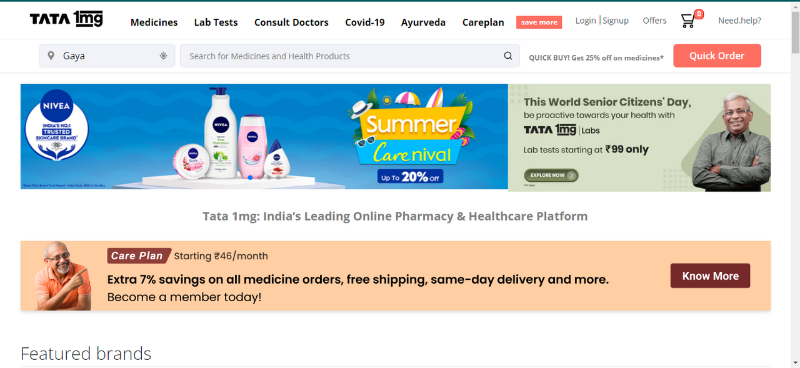
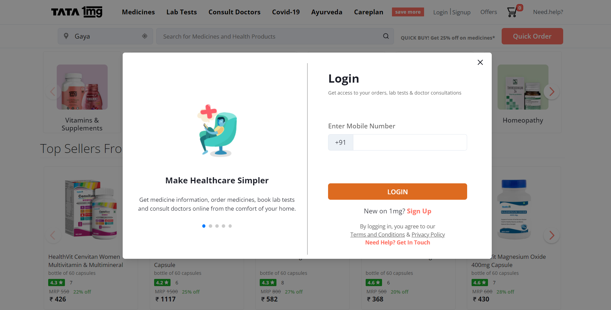
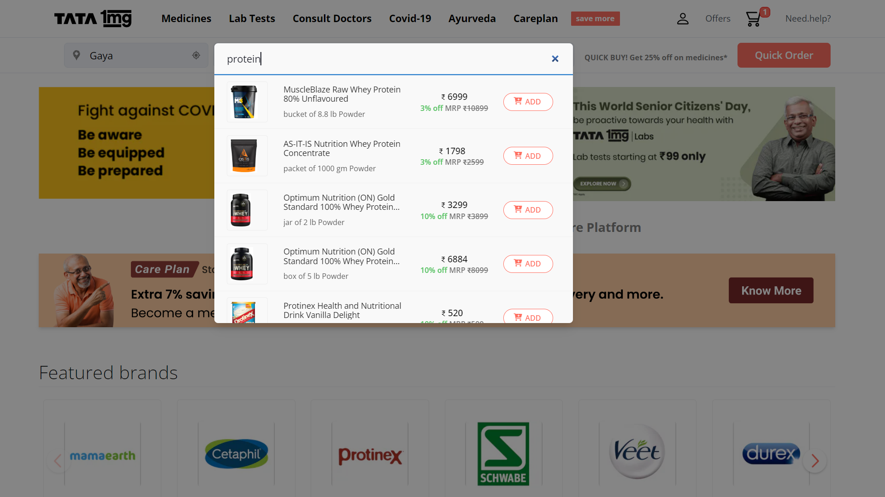
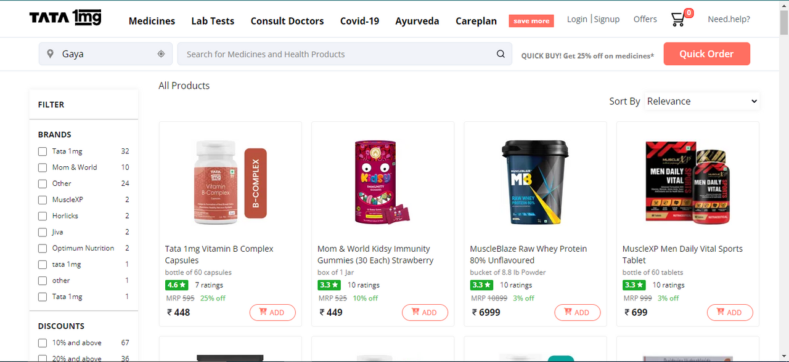
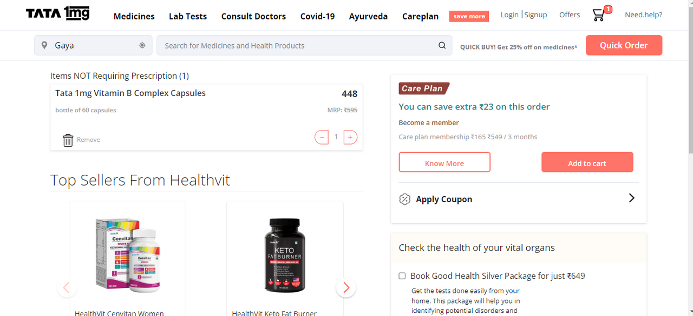
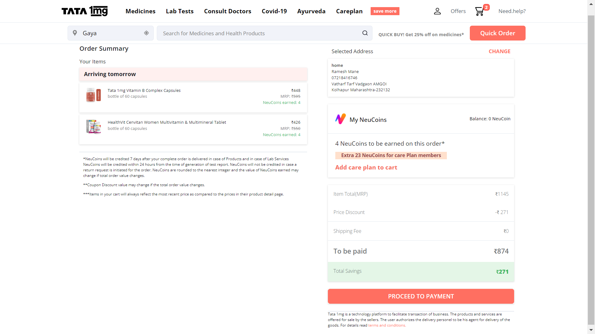
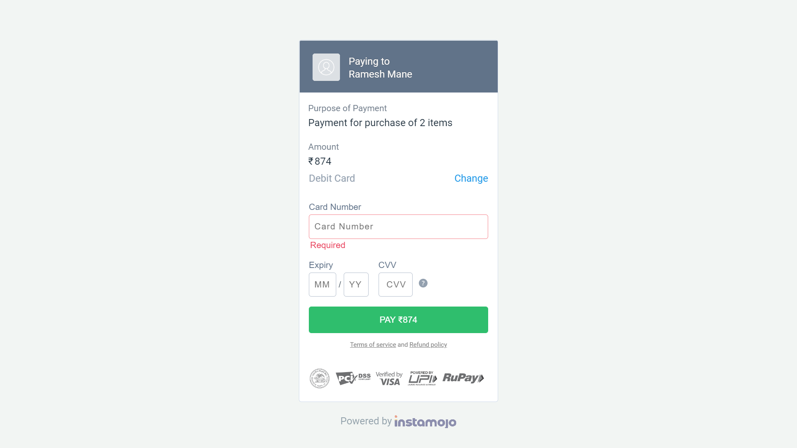
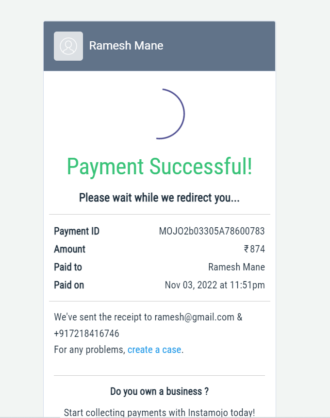
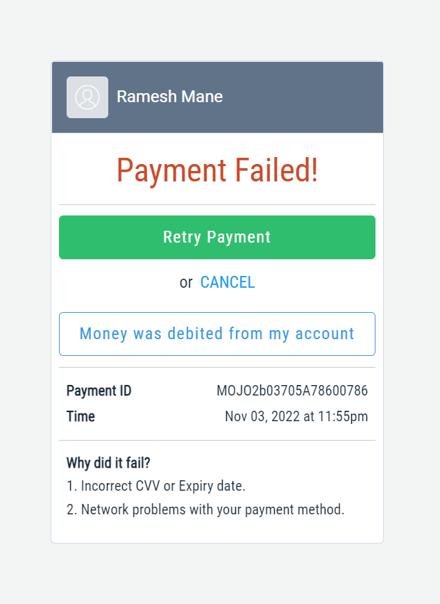

<h1 align="center">1mg.com Clone</h1>
<h3 align="center">It's a MERN Stack healthcare web application with all the major functionalities</h3>

<br/>

<h2 align="center">🖥️ Tech Stack</h2>

<h4 align="center">Frontend:</h4>
<p align="center">
  
  
  
  
  
  
  
  
</p>
<h4 align="center">Backend:</h4>

<p align="center">
  
  
  
</p>

<h4 align="center">Payment Gateway:</h4>

<p align="center">
  
</p>

<h4 align="center">Deployed On:</h4>

<p align="center">
  
  
</p>

<h3 align="center"><a href="https://tata1mg-clone-nem201.vercel.app/"><strong>Want to see live preview »</strong></a></h3>

Tata 1mg is India’s leading consumer health platform. It provides services, including e-pharmacy, diagnostics, e-consultation and health content.
<br/>

## 🚀 Features

-   Login and Signup Page with mobile OTP
-   Firebase Authentication
-   Product Filters Based on Brand and Discount
-   Product Sorting Based on Price, Rating
-   Product Filtering and Sorting works together
-   Cart Add and Remove Items
-   Cart Update Quantities
-   Address Management
-   Order Summary
-   Instamojo Payment Gateway

## 🚀 Our Team Members:-

-   Ramesh [[LinkedIn Profile](https://www.linkedin.com/in/ramesh-mane-268a0014a/)]

-   Rahul Singh [[LinkedIn Profile](https://www.linkedin.com/in/rahul-singh-437a4b234/)]

-   Shristi Kumari [[LinkedIn Profile](https://www.linkedin.com/in/shristi-kumari-b07927247/)]

-   Himanshu Sharma [[LinkedIn Profile](https://www.linkedin.com/in/himanshu-40a7b7135/)]

## Screenshots

### Homepage -

This is the main landing page of our website. Here, if you clicked on any navigation then you will redirect to respective page. Also, we have added searching of product option with debouncing feature.

All pages are responsive.



### Sign up / Sign in Page -

On this page, you can register a user. If the user is already registered, you can simply sign in by providing valid details of the user. We have used `Firebase Authentication` so, once you entered your mobile number you will get `OTP`, you need to enter that `OTP`.



### Search Functionality

If you type any `keyword` the list of product will appear in the modal component. You can add it to cart directly from here or you can see more details by clicking on the product.
We have added debouncing functionality on searching products.



### Products Page -

Here users can browse, `filter` the product based on `brand and discound`, `sort` by `price or rating`, filter and sort will work togather and add items to the cart by clicking on the `Add to Cart` button.



### Cart Page -

Here all the products added to the cart will be shown. On this page, you can `remove` the item from cart and also, `increase` or `decrease` count. By clicking on the `CHECKOUT` button you will be redirect to the checkout page.



### Order Summary Page -

On this page you will see all details like, address, total bill, shipping address. By clicking on `Proceed to payment` button you will be redirect to payment page.



### Payment Page -

For payment, we have used `Instamojo Payment Gateway`. So, users need to add required card details.

`Note:` For demo purpose use below card details

-   Card Number: `4242 4242 4242 4242`
-   Expiry: `01/25`
-   CVV: `111`



### Payment Status

After submitting the payment details you will get `Payment Successful` or `Payment Failed` depending on the `status of the payment`. Also, you received mail of bill details of order.

<table>
  <tr>
    <td></td>
    <td></td>
  </tr>
</table>

## Run Locally

Clone the project

```bash
  git clone https://github.com/rameshmane7218/humane-shelf-7123.git
```

Go to the project directory

```bash
  cd humane-shelf-7123
```

Install dependencies for frontend as well as backend

```bash
  cd frontend
  npm install
```

```bash
  cd ../backend
  npm install
```

Start the localhost server

```bash
  cd ../frontend
  npm start
```

## Deployed link

### Vercel Link

[https://tata1mg-clone-nem201.vercel.app/](https://tata1mg-clone-nem201.vercel.app/)

## Show your support

Give a ⭐️ if you like this project!
